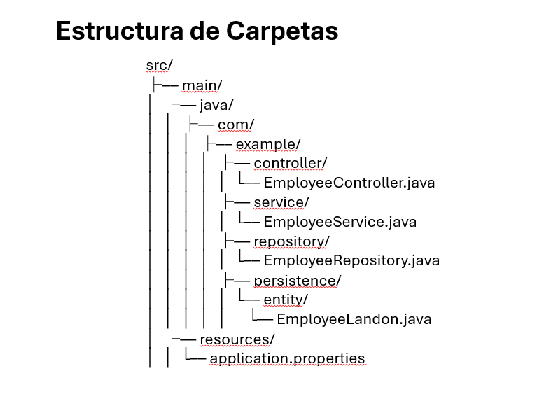
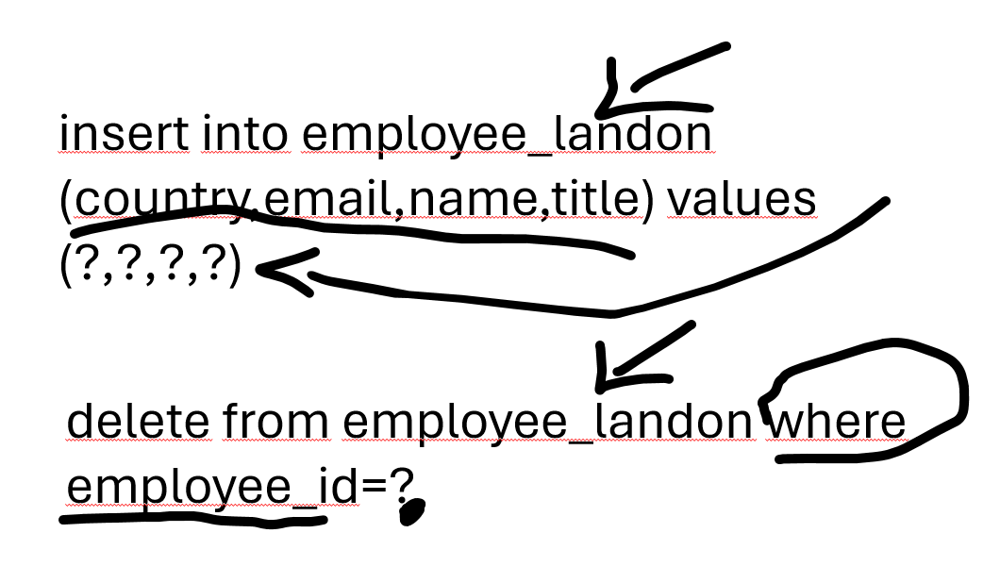
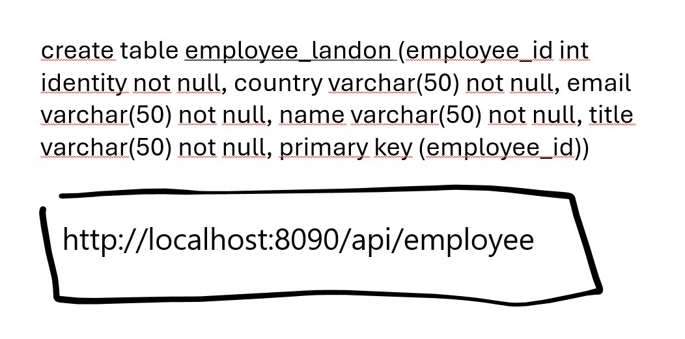
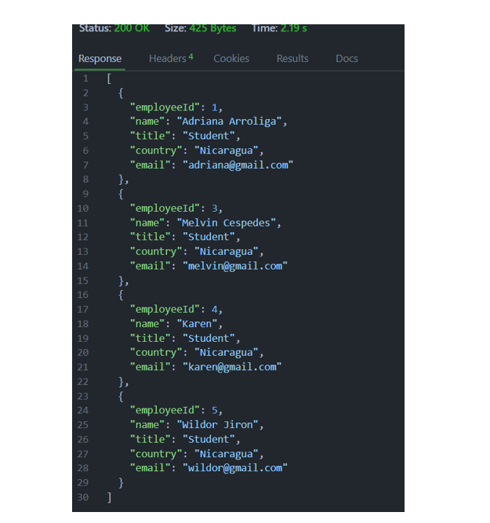

# About

JPA (Java Persistence API) is a Java specification that provides a standard way to map Java objects to relational databases. It simplifies the process of working with databases in Java applications.

Spring Boot is a framework that simplifies the development of Java applications, particularly web applications. It provides a set of tools and conventions that make it easy to create standalone, production-grade Spring-based applications.

When used together, JPA and Spring Boot provide a powerful combination for building database-driven applications. Spring Boot takes care of the application configuration and setup, while JPA handles the object-relational mapping and database interactions.

By leveraging JPA and Spring Boot, developers can focus on writing business logic and let the framework handle the underlying database operations. This results in cleaner and more maintainable code, as well as improved productivity.

To get started with JPA and Spring Boot, you can refer to the official documentation and explore various tutorials and examples available online. Happy coding!

# Project Structure

# JPA SQL

# Results

